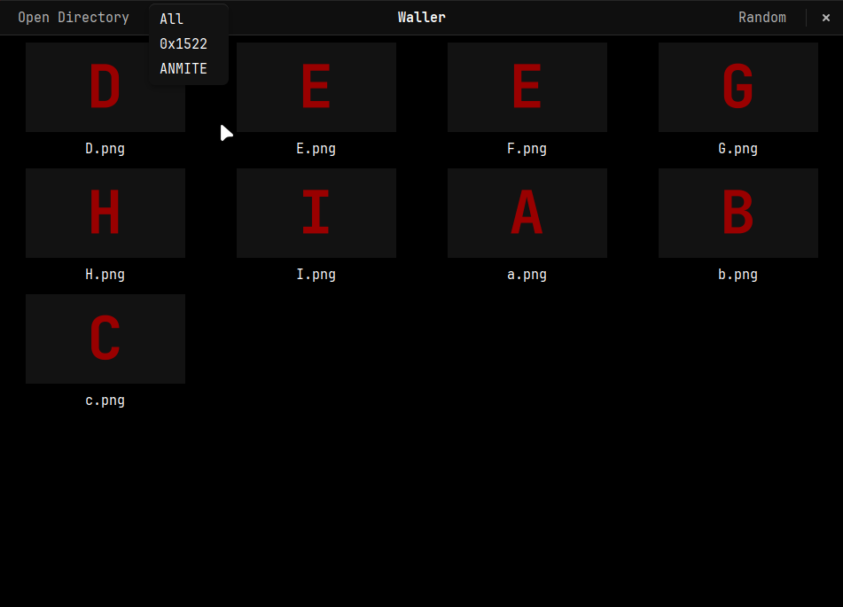

# Waller

A GUI wallpaper setter for Wayland using the layer shell protocol.



## Features

- Multi-monitor support
- GUI and CLI interface
- Automatic wallpaper changing

## Requirements

- Wayland compositor with layer-shell support (Hyprland, Sway, etc.)
- GTK3

## Usage

```sh
# Launch the GUI
waller

# Apply a random wallpaper to all monitors
waller --random

# Apply random wallpaper to a specific monitor
waller --random --monitor-index 0

# Auto-rotate wallpapers every 5 minutes
waller --auto 300
```

## Installation

- Using the nix flake

```sh
# Run directly
nix run github:Hy4ri/waller

# Install to profile
nix profile install github:Hy4ri/waller
```

- Declarative (NixOS/Home Manager)

```nix
# flake.nix
{
  inputs.waller.url = "github:Hy4ri/waller";
}

# configuration.nix or home.nix
{ inputs, ... }:
{
  nixpkgs.overlays = [ inputs.waller.overlays.default ];
  environment.systemPackages = [ pkgs.waller ]; # or home.packages
}
```

- Build from source

```sh
git clone https://github.com/Hy4ri/waller
cd waller
nix develop
go build -o waller
```
